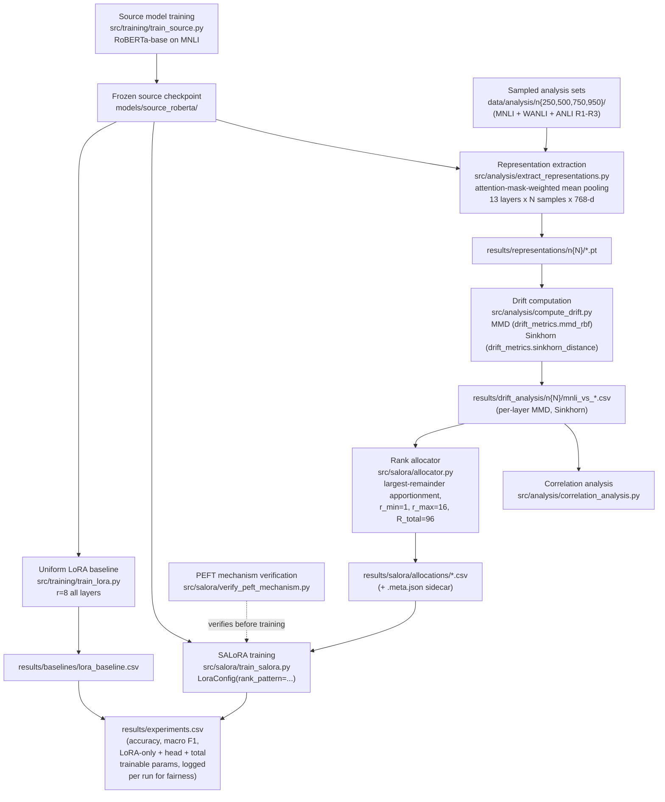

# SALoRA: Shift-Aware Layer-wise Parameter Allocation for Parameter-Efficient Domain Adaptation

---

# Version

v2.0 (2026-09-10) — supersedes v1.0. v1.0 stated the research problem, RQs, and
hypotheses with no architecture, no drift-measurement justification, and no
grounding in real data (nothing had been run yet). This revision adds all of
that, using verified results from `docs/design/Repository_Audit_Report.md` and
`docs/design/SALoRA_Allocation_Spec.md`, and is written to directly answer the
five open items in `docs/design/Reviewer_Concerns.md`. Where a claim below is
still open pending experiments that haven't run yet, it says so explicitly —
this document does not round an open question up to a settled one.

---

# Objective

Develop a parameter-efficient domain adaptation framework that performs
adaptation planning *before* fine-tuning by analyzing representation geometry
between source and target domains.

Instead of allocating LoRA parameters uniformly or dynamically during
training, SALoRA investigates whether layer-wise representation drift,
measured once from a frozen source model before any target-domain training
begins, can be used as a practical signal for allocating adaptation capacity
under a fixed parameter budget.

---

# Target Publication

Primary: Q3-indexed journal. Stretch: Q2. Publication is prioritized over
novelty — see `docs/design/Project_Specification.md` for the full framing
(reproducibility and rigor over an ambitious theoretical claim).

---

# Research Problem

Existing PEFT rank-allocation methods (surveyed in `paper/outline.md` Section
2 / `paper/references.bib`) determine adaptation capacity one of two ways:

1. **Fixed allocation** — the same LoRA rank at every layer (plain LoRA
   \cite{hu2021lora}).
2. **Dynamic, in-training allocation** — rank or importance recomputed *during*
   fine-tuning from a task-internal signal: SVD-pruned importance scores
   (AdaLoRA \cite{zhang2023adalora}), Fisher-information estimates (LAARA
   \cite{tripathi2026laara}), gradient-driven budgets (La-LoRA
   \cite{gu2025lalora}), elastic pruning/expansion (ElaLoRA
   \cite{chang2025elalora}), Bayesian inference over layers (BaRA
   \cite{duan2026bara}), or the stable rank of the frozen weights themselves
   (SR-LoRA \cite{zhang2025srlora}).

None of these allocate rank from a pre-computed measurement of how far the
*target domain's own data distribution* has drifted from the *source
domain's*, taken before fine-tuning starts. That is the gap this project
targets:

> Can representation drift, measured between source and target domains
> **before** fine-tuning, be used as a practical signal for planning
> parameter-efficient adaptation?

A literature scan (not a systematic review) found no prior work using MMD or
Sinkhorn/Wasserstein distance — both established tools for *measuring or
minimizing* domain divergence
\cite{shen2017wasserstein,su2019wasserstein,wang2020rethinkmmd} — as the
*allocation signal* for non-uniform LoRA rank. See "Reviewer Concerns
Crosswalk" below for the honest caveat on how strong this novelty claim is.

---

# Research Questions and Current Status

| # | Question | Status as of 2026-09-10 |
|---|---|---|
| RQ1 | Can layer-wise representation drift be measured reliably between source and target domains? | **Supported.** MMD and Sinkhorn profiles are stable across N=250–950 (MMD ≤13% relative variation, Sinkhorn ≤1.1%) and the masked-pooling fix didn't change this. |
| RQ2 | Do different domains exhibit distinct layer-wise drift profiles? | **Supported, with a complication.** WANLI/ANLI R1/R2/R3 do show distinct profiles (see the mean-drift table below), but MMD and Sinkhorn frequently *disagree* with each other about what those profiles look like — see "Known Deviations" below. |
| RQ3 | Can representation drift serve as a useful proxy for adaptation planning? | **Open.** This is the crux of Reviewer Concern 1 and is addressed empirically, not asserted — see "Drift vs. Difficulty" below for the current evidence, which is genuinely mixed. |
| RQ4 | Can representation-guided allocation outperform fixed LoRA allocation under an equivalent parameter budget? | **Untested as of this revision.** Zero completed SALoRA-vs-uniform comparisons exist at the time of writing; the training matrix (Section "Experimental Design") is what will answer this. One real data point exists (SALoRA-MMD on ANLI R1, seed 42: 44.3% acc vs. uniform's 44.4%) — a single run, not remotely conclusive on its own. |

# Hypotheses

- **H1** — Different target domains produce different representation drift
  patterns across transformer layers. *(Supported — see RQ2.)*
- **H2** — Representation drift contains useful information for adaptation
  planning. *(Open — this is what RQ3/RQ4 test.)*
- **H3** — Layer-wise allocation based on representation drift performs
  competitively against fixed-rank LoRA under the same overall budget.
  *(Untested — pending the training matrix.)*

# Scope

This project does **not** attempt to prove representation drift is
theoretically equivalent to adaptation capacity. It empirically investigates
whether drift is a useful *engineering signal* for parameter allocation. Any
observed relationship is validated experimentally, not assumed mathematically
— consistent with `docs/design/Project_Specification.md`'s "empirical first,
theoretical second" philosophy.

---

# System Architecture

## Module-by-module

| Stage | File | Verified? |
|---|---|---|
| Source model training | `src/training/train_source.py` | Done; matches `results/baselines/source_baseline.csv` |
| Zero-shot evaluation | `src/evaluation/evaluate_source.py` | Done |
| Uniform LoRA baseline | `src/training/train_lora.py` | Done; matches `results/baselines/lora_baseline.csv` |
| Representation extraction | `src/analysis/extract_representations.py` | Fixed 2026-09-05 (masked mean pooling; previously included padding tokens in the mean) and re-run for all N/targets |
| Drift metrics | `src/analysis/drift_metrics.py` (`mmd_rbf`, `sinkhorn_distance`) | Re-verified against masked-pooling representations |
| Correlation analysis | `src/analysis/correlation_analysis.py` | Re-run; see "Known Deviations" |
| Rank allocator | `src/salora/allocator.py` | 21/21 unit tests passing; implements `docs/design/SALoRA_Allocation_Spec.md` exactly |
| PEFT mechanism check | `src/salora/verify_peft_mechanism.py` | Run against the real checkpoint 2026-09-05; 2 of 4 checks pass outright, the other 2 are explained (see below) |
| SALoRA training | `src/salora/train_salora.py` | 1 of 10 initial-pass runs completed (MPS); remainder moved to Colab GPU (`notebooks/colab_train_salora.ipynb`) |

---

# Drift Measurement Methodology

## What is measured, and why this specific design

- **Frozen, task-fine-tuned source-model representations**, not a
  general-purpose sentence embedding model. The drift signal is deliberately
  defined as "how differently does *this specific model* (the one that will
  be adapted) see the target domain, compared to the domain it was trained
  on" — not domain shift in some model-agnostic sense. This is a stated
  assumption, not an incidental implementation detail: it's what makes the
  signal actionable for *this* model's adaptation, as opposed to a general
  corpus-linguistics measure of domain distance.
- **Layer-wise, not a single pooled score.** Because LoRA rank is allocated
  per layer, the drift signal must be per layer to be actionable — a single
  global number couldn't tell the allocator which layers need more capacity.
- **Attention-mask-weighted mean pooling** over non-padding tokens only. An
  earlier implementation used `hidden.mean(dim=1)`, which averaged over the
  full padded sequence and diluted the pooled vector by however much padding
  a given batch happened to contain (dynamic padding batches aren't
  shuffled, so this was deterministic per run but still not "mean of
  non-padding tokens" as documented). Fixed 2026-09-05; every drift number in
  this document is post-fix.
- **MMD (Gaussian RBF, median-heuristic bandwidth) and Sinkhorn (entropic
  Wasserstein, `reg=1.0`, L2-normalized inputs) computed and reported
  completely separately — never averaged or combined into one score.** This
  is a deliberate, spec-level rule (`SALoRA_Allocation_Spec.md` Section 7),
  not an oversight: MMD and Sinkhorn are different mathematical objects.
  MMD (with an RBF kernel) is primarily sensitive to *mean* discrepancy
  between distributions in a nonlinear feature space; Sinkhorn/entropic
  optimal transport accounts for the full transport cost, including
  higher-order shape/geometry differences. Treating them as interchangeable,
  or averaging them, would erase exactly the kind of disagreement
  \citet{wang2020rethinkmmd} argue is under-examined in MMD-based domain
  adaptation work generally.

## Sample-size stability (RQ1)

Checked across N=250/500/750/950 after the pooling fix: MMD's layer-wise
profile varies ≤13% relative, Sinkhorn's ≤1.1%, for the same target. Argmax/
argmin layers are unchanged across N. This supports treating N=950 as a
stable operating point rather than a sample-size artifact.

**Caveat worth stating plainly, not hiding:** both MMD and Sinkhorn are
distributional-distance estimators, and finite-sample estimates of
distributional distances between modest-size samples (n≈250–950) of
high-dimensional (768-d) representations carry a known estimation bias — MMD's
U-statistic estimator has a dimension-independent O(1/√n) convergence rate,
which is favorable, but the entropic-regularized Sinkhorn estimate's bias
depends on the regularization strength and the effective dimensionality of the
representations, not just n. The sample-size stability check above is
evidence the *ranking/shape* is stable, not proof the *absolute magnitude* of
either estimator has converged. This matters for any claim stronger than "the
relative ordering of layers is stable" — a reviewer could reasonably ask for
a bias-correction or larger-N sensitivity check before trusting absolute
magnitudes.

## MMD vs. Sinkhorn agreement — the honest picture

| Target | Old Spearman (pre-fix) | New Spearman (post-fix) |
|---|---|---|
| WANLI | −0.15 to −0.32, n.s. | +0.08, n.s. |
| ANLI R1 | **−0.60 to −0.66, p<0.05** | **−0.60 to −0.63, p<0.05 (survived)** |
| ANLI R2 | **−0.625 to −0.65, p<0.05** | **−0.40 to −0.45, p=0.13–0.17 (did NOT survive)** |
| ANLI R3 | −0.19 to −0.41, n.s. | **+0.53 to +0.54, p=0.05–0.06 (flipped sign, borderline)** |

The original framing ("MMD and Sinkhorn are significantly anti-correlated on
ANLI R1 *and* R2") only holds for R1 after the pooling fix. This needs to be
the paper's framing going forward: **the two metrics disagree, but not
uniformly across targets, and the disagreement pattern itself changed with a
methodology fix** — which is itself evidence the disagreement is a real,
sensitive signal worth reporting carefully, not noise to average away.

## Drift vs. difficulty — a finding that must be addressed directly (Reviewer Concern 1)

This is the central question a reviewer will ask, and the project's own
`Reviewer_Concerns.md` already lists it as open. Here is the actual data,
computed 2026-09-10 from `results/drift_analysis/n950/` (mean over the 12
encoder layers, embedding layer excluded per the spec):

| Target | Mean MMD | Mean Sinkhorn | Zero-shot accuracy |
|---|---|---|---|
| WANLI | 0.0281 (lowest) | 0.4936 | 60.88% (least degraded) |
| ANLI R1 | 0.2095 (highest) | 0.5075 (highest) | 31.30% |
| ANLI R2 | 0.2067 | 0.5064 | 30.10% |
| ANLI R3 | 0.0975 | **0.4834 (lowest of all 4)** | **28.58% (most degraded)** |

**This does not track monotonically.** ANLI R3 is the hardest target by
zero-shot accuracy, by a clear margin, yet it shows the *lowest* Sinkhorn
drift of all four targets — lower than WANLI, which is by far the easiest
target. If "drift" and "difficulty" were the same thing, this ordering would
be reversed.

This is not treated here as a flaw to explain away — it's evidence that
**drift (representational/distributional shift) and difficulty (resulting
accuracy degradation) are related but distinct constructs**, and the
distinction has a principled explanation grounded in how these datasets were
actually built:

- **ANLI** \cite{nie2020anli} was collected via an iterative
  human-and-model-in-the-loop adversarial procedure: annotators were shown a
  live "target model" and explicitly tasked with writing examples that fooled
  it, with the target model escalating across three rounds (R1: BERT-Large;
  R2: RoBERTa-Large ensemble; R3: RoBERTa-Large ensemble with multi-domain
  contexts). Difficulty here is *engineered against a model's specific
  weaknesses*, not produced by a large surface-level or stylistic shift — an
  adversarial example can look representationally unremarkable to the model
  while still tripping up its reasoning.
- **WANLI** \cite{liu2022wanli} was built differently: dataset cartography
  identifies challenging *patterns* in MultiNLI, GPT-3 generates new examples
  matching those patterns, and crowdworkers filter/revise. This is a
  pattern-completion process, not an adversarial-targeting one, and produces
  a dataset that is stylistically further from MNLI (hence higher MMD than
  R3) but easier for the model to actually get right.

**What this means for the project, stated plainly:** SALoRA's hypothesis is
that allocating capacity by *representational drift* helps adaptation — not
that drift equals difficulty. The ANLI R3 dissociation is, if anything, a
sharper test of that hypothesis: it's a case where a difficulty-based
allocation heuristic and a drift-based one would clearly disagree, so it's a
genuinely informative condition to include in the experimental matrix rather
than an embarrassment to omit. **This paragraph is itself the answer to
Reviewer Concern 1 that the project should give — not a claim that the
concern is resolved, since RQ4/H3 (does drift-based allocation actually win)
is still untested, but a grounded explanation of why drift and difficulty
should be expected to diverge sometimes, backed by how the benchmarks were
actually constructed.**

---

# Allocation Methodology (summary — full spec is frozen in `SALoRA_Allocation_Spec.md`)

- Eligible layers: the 12 encoder layers (embedding layer excluded — no LoRA
  module lives there in any method).
- `R_total = 96` (12 layers × uniform baseline's r=8), `r_min=1`, `r_max=16`.
- `w_l = D_l / Σ D_j`, `raw_r_l = R_total × w_l`, rounded via largest-remainder
  (Hamilton) apportionment, clamped to `[r_min, r_max]`, with any shortfall/
  surplus from clamping redistributed deterministically (spec Section 6).
- `lora_alpha = 16` constant across every layer and method — **not** scaled
  with rank, so rank is the only manipulated variable between methods (spec
  Section 10).
- Methods: A (zero-shot), B (uniform LoRA), C (SALoRA-MMD), D
  (SALoRA-Sinkhorn), E (random allocation, fixed `allocation_seed`), F
  (inverse-drift), G (AdaLoRA, conditional on a genuinely matched budget).

---

# Parameter Budget & Fairness (Step 5 / Step 3 finding)

Verified 2026-09-05 against the real checkpoint (`verify_peft_mechanism.py`):

- The allocator's LoRA-only math is exactly correct: 294,912 trainable params
  for `R_total=96`, confirmed both by hand-computation and by the real
  `get_peft_model` output.
- `peft`'s `get_peft_model(..., task_type=TaskType.SEQ_CLS)` **automatically
  wraps the classifier head in `modules_to_save`**, adding 592,899 trainable
  params, even though no method config passes `modules_to_save` explicitly.
  Verified this is a **fixed constant, independent of rank pattern** (checked
  both the uniform r=8 config and a deliberately non-uniform smoketest
  allocation — both add exactly 592,899).
- **Total trainable parameters for every method (except A, zero-shot) is
  887,811 = 294,912 (LoRA) + 592,899 (head), not 294,912.** This is logged as
  a dated Deviation Log entry in `SALoRA_Allocation_Spec.md` Section 14 and
  is why `results/experiments.csv` logs `LoRA_Only_Params`, `Head_Params`, and
  `Total_Trainable_Params` separately for every run — the fairness claim
  ("identical total trainable parameters across methods") is verified
  programmatically per run, not asserted once and assumed to hold.
- **Implication for AdaLoRA (method G):** its matched target budget must
  target 887,811 total, not 294,912, if/when it's attempted.

---

# Experimental Design

## Controls held identical across every method (per `Project_Specification.md` and the non-negotiable research-integrity rules)

Model, data, optimizer, learning rate (2e-4), epochs (3), batch size (16),
target modules (query, value), and total trainable-parameter count
(887,811) — verified programmatically and logged with every run, not assumed.

## Matrix

| Phase | Methods x Targets x Seeds | Status |
|---|---|---|
| Initial pass | 5 methods (C, D, E, F, and F-Sinkhorn) x {ANLI R1, ANLI R2} x seed 42 | 1/10 runs done (SALoRA-MMD, ANLI R1: 44.3% acc / 43.9% F1 vs. uniform's 44.4% / 44.0% — a tie, not a win, single run) |
| Causal probe (spec Section 13) | Boost (`r=16`)/cut (`r=4`) on 4 selected layers, ANLI R1+R2, 1 seed | Not started; open design question — probe the layers MMD's profile picks, Sinkhorn's, or both, given the two metrics now disagree about which layers are max/min/mid |
| Full matrix (conditional on initial-pass signal) | 5 methods x 4 targets x 3 seeds | Not started |
| AdaLoRA | Conditional on matched-budget feasibility | Not attempted |

## Statistical significance plan (Reviewer Concern 5)

Not yet formally specified beyond "3 seeds" — this needs a concrete decision
before the full matrix runs: paired comparison across seeds (same seed used
for SALoRA and uniform, difference tested per-seed) vs. independent-samples
comparison, and what test (paired t-test, bootstrap CI, Wilcoxon given only 3
seeds). Flagging this as an open item rather than picking one silently.

---

# Benchmark Justification — the R7 tension (Reviewer Concern 3)

`docs/design/Benchmark_Requirements.md` R7 asks for **"different semantic
domains"**, giving examples like scientific, legal, biomedical, financial.
**WANLI and ANLI R1–R3 do not satisfy this as originally written** — they are
all general-domain NLI, differing in *how the examples were constructed*
(adversarial-targeting vs. pattern-based generation, per the citations above),
not in subject-matter domain. `docs/design/Decision_Log.md` Decision 005
still says the benchmark is "not yet locked, awaiting systematic evaluation,"
which is stale — WANLI/ANLI/MNLI have been used in every experiment for
months — but simply marking it "locked" without addressing R7 would leave a
real gap a reviewer will catch immediately.

**Recommended resolution (not yet executed — this is a decision for you):**
reframe the project's claim from "domain adaptation" to **"distribution
shift adaptation"** or **"stylistic/adversarial robustness adaptation"**,
which is what WANLI/ANLI actually represent and is consistent with how
\citet{nie2020anli} and \citet{liu2022wanli} frame their own datasets. This
was already flagged in `Repository_Audit_Report.md` Section 6 as an open
question; it has not been decided or acted on since. Doing so requires:
touching the paper's framing/title language, `Scientific_Identity.md`, and
`Benchmark_Requirements.md`/`Decision_Log.md` consistently — not just one of
them.

---

# Reviewer Concerns Crosswalk

Cross-referencing `docs/design/Reviewer_Concerns.md`, all five marked "Open"
as of the last update. Current status:

1. **"Why should representation drift imply adaptation demand?"** — Addressed
   with grounded evidence above ("Drift vs. difficulty"), but genuinely
   **still open** until RQ4/H3 are tested. The explanation given is
   defensible, not a proof.
2. **"Is SALoRA sufficiently different from AdaLoRA?"** — **Answered.** All
   surveyed adaptive-rank methods (AdaLoRA and five 2025–2026 successors) use
   in-training or static-weight signals; none use a pre-computed domain-shift
   measurement. See `paper/outline.md` Section 2. Caveat: this is a
   literature *scan*, not a systematic review — worth a more thorough search
   pass before final submission.
3. **"Is the benchmark appropriate?"** — **Still open**, see "Benchmark
   Justification" above. Needs an explicit decision (reframe to "distribution
   shift"), not just an assertion that it's fine.
4. **"Does the pre-analysis cost outweigh the training savings?"** — **Not
   yet quantified.** The drift analysis is a one-time, frozen-model
   forward-pass cost per target domain (no backprop, no gradient updates);
   should be cheap relative to a full fine-tuning run, but this hasn't been
   measured and reported. Add wall-clock timing to `extract_representations.py`
   and `compute_drift.py` runs and report it next to training time.
5. **"Are improvements statistically significant?"** — **Blocked** on the
   full matrix (3 seeds) and an explicit significance-testing plan (see
   "Statistical significance plan" above, also undecided).

---

# Known Deviations & Limitations (consolidated)

- Classifier head auto-trainable via `peft`'s `TaskType.SEQ_CLS` default —
  constant across methods, doesn't break fairness, but total trainable
  params is 887,811 not 294,912 (see "Parameter Budget & Fairness").
- MMD/Sinkhorn agreement is target-dependent and changed after the
  masked-pooling fix (R1 survived, R2 did not, R3 flipped sign) — must be
  framed honestly in the paper, not as a stable finding.
- Naming collision: \citet{li2025salora} is an existing, unrelated,
  published ICLR 2025 method whose acronym differs from this project's
  "SALoRA" only in capitalization. **Undecided**: rename vs. explicit
  disambiguation in the paper.
- `docs/design/Paper_Contributions.md` Contribution 5 ("Extensive comparison
  against state-of-the-art PEFT methods," marked "Locked") is not
  achievable as stated — only one additional PEFT baseline (AdaLoRA) is
  planned, conditional on a matched budget. Needs downgrading before this is
  presented anywhere as a locked claim.
- Experiment ledger (`results/experiments.csv`) was ~80% incomplete relative
  to actual runs as of the last audit; being appended to correctly for new
  SALoRA runs, but the backlog (source model training run, 3 of 4 ANLI LoRA
  baseline runs) has not been backfilled.
- 460MB source checkpoint has no durable storage plan beyond a local zip
  file and ad hoc Google Drive upload for Colab — worth deciding on (HF Hub
  private repo is the standard choice) before this becomes a reproducibility
  blocker.

---

# Defense Q&A Appendix

Anticipated questions, with which answer above to point to:

- *"Isn't this just AdaLoRA with extra steps?"* → No — AdaLoRA's signal is
  computed from SVD/importance during training; SALoRA's is computed once,
  before training, from domain-shift metrics. See "Reviewer Concerns
  Crosswalk" #2.
- *"Why do MMD and Sinkhorn disagree, and which one is right?"* → Neither is
  "right" — they measure different things (mean discrepancy vs. full
  transport cost) by design, and the disagreement pattern is itself reported
  as a finding, not resolved by picking a favorite. See "MMD vs. Sinkhorn
  agreement."
- *"If ANLI R3 is the hardest target, why doesn't it show the most drift?"*
  → Because ANLI's difficulty is adversarially engineered against a model,
  not produced by gross distributional shift — see "Drift vs. difficulty."
  This is the single question this document is most directly written to
  answer, because it's the one most likely to come up first.
- *"Is this really domain adaptation, or just robustness to adversarial/
  stylistic NLI examples?"* → Currently an open, unresolved framing choice
  — see "Benchmark Justification." Answering "yes, it's domain adaptation"
  without qualification is not currently defensible given R7.
- *"How do you know the parameter budgets are actually equal across
  methods?"* → Verified programmatically per run (887,811 total for every
  non-zero-shot method), not asserted from the allocation formula alone. See
  "Parameter Budget & Fairness."
- *"Do you have a result yet?"* → One real data point (SALoRA-MMD vs. uniform
  on ANLI R1, single seed): a statistical tie. Not enough to claim anything.
  The honest answer is "the experiment that would tell us is still running."
